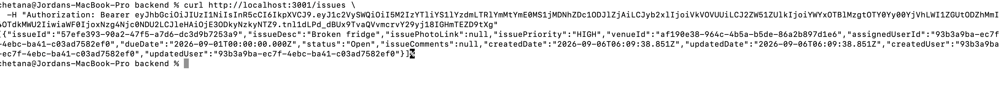
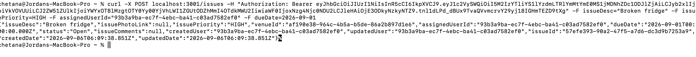
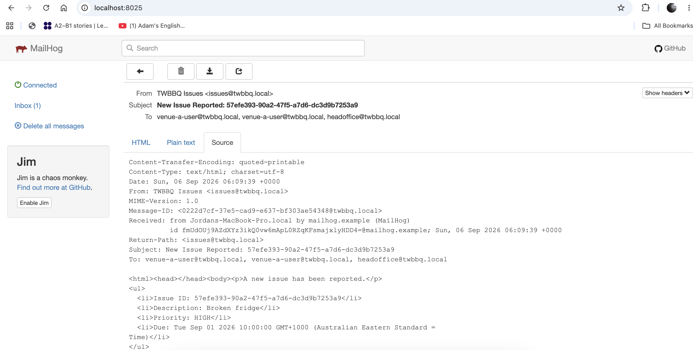
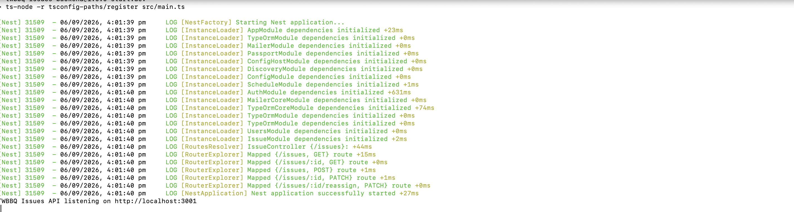
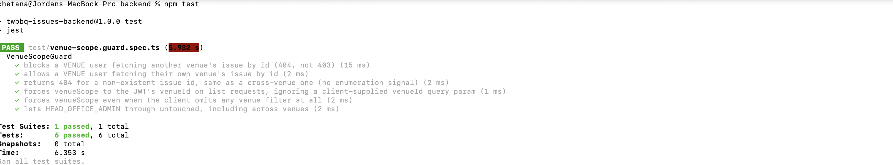

# TWBBQ Issues

A backend service for managing venue maintenance issues, including issue creation, assignment, priority, status, due dates, venue-level access control, authentication, and operational notifications.

This project was developed as part of the **Third Wave BBQ Graduate Software Developer, AI & Automation assessment**.

---

## Overview

The application provides a centralised issue-management system for restaurant venues.

Venue users can create and manage issues within their authorised venue, while Head Office users can access issues across venues.

The system focuses on:

* Venue-level data isolation
* Authentication and authorisation
* Issue creation and management
* Issue assignment
* Priority and status management
* Due dates
* Comments
* Automated testing
* Email notification support
* Secure deployment practices
* AI-assisted development with human review

---

## Technology Stack

### Backend

* NestJS
* TypeScript
* TypeORM
* PostgreSQL
* JWT Authentication
* Jest

### Frontend

* Next.js
* React
* TypeScript

### Development / Infrastructure

* Docker
* Docker Compose
* MailHog
* Git / GitHub
* Ubuntu VPS

---

# Features

## Issue Management

Users can:

* Create issues
* View issues
* Update issues
* Assign issues
* Set issue priority
* Set issue status
* Set due dates
* Add comments
* Associate issues with a venue

## Venue Access Control

Venue users can only access issues belonging to their own venue.

Head Office administrators can access issues across venues.

The backend determines the venue scope from the authenticated user's JWT rather than trusting a venue ID supplied by the client.

Cross-venue issue access returns `404 Not Found` to avoid exposing whether an issue exists in another venue.

---

# Architecture

The application follows a standard frontend/backend architecture.

```text
                    ┌──────────────────┐
                    │   Next.js UI     │
                    │    Frontend      │
                    └────────┬─────────┘
                             │
                             │ HTTP / REST
                             ▼
                    ┌──────────────────┐
                    │    NestJS API    │
                    │     Backend      │
                    └────────┬─────────┘
                             │
             ┌───────────────┼────────────────┐
             │               │                │
             ▼               ▼                ▼
       ┌──────────┐    ┌───────────┐    ┌──────────┐
       │   Auth   │    │  Issues   │    │  Users   │
       │  Module  │    │  Module   │    │ /Venues  │
       └──────────┘    └─────┬─────┘    └──────────┘
                             │
                             ▼
                    ┌──────────────────┐
                    │   PostgreSQL     │
                    └──────────────────┘
                             │
                             ▼
                    ┌──────────────────┐
                    │     MailHog      │
                    │ Local Email Test │
                    └──────────────────┘
```

---

# Project Structure

```text
TwBBQ_Issue_repo/
│
├── backend/
│   ├── src/
│   │   ├── auth/
│   │   ├── issues/
│   │   ├── users/
│   │   ├── venues/
│   │   └── ...
│   │
│   ├── test/
│   │   └── venue-scope.guard.spec.ts
│   │
│   ├── migrations/
│   │
│   ├── package.json
│   ├── package-lock.json
│   ├── docker-compose.yml
│   ├── .env.example
│   └── ...
│
├── frontend/
│   └── ...
│
├── docs/
│   └── images/
│       ├── issue-list.png
│       ├── create-issue.png
│       ├── mailhog-dashboard.png
│       ├── backend-running.png
│       └── automated-tests.png
│
├── .gitignore
└── README.md
```

---

# Prerequisites

The following tools are required for local development:

* Node.js
* npm
* Docker
* Docker Compose
* Git

---

# Local Development

## 1. Clone the Repository

```bash
git clone https://github.com/chetupatil/TwBBQ_Issue_repo.git
cd TwBBQ_Issue_repo
```

---

## 2. Install Backend Dependencies

```bash
cd backend
npm install
```

---

## 3. Configure Environment Variables

Create the local environment file:

```bash
cp .env.example .env
```

Configure the required database, JWT and application settings.

Example:

```env
DATABASE_HOST=localhost
DATABASE_PORT=5432
DATABASE_USER=postgres
DATABASE_PASSWORD=postgres
DATABASE_NAME=twbbq

JWT_SECRET=change-me
```

Secrets should never be committed to Git.

---

# Start PostgreSQL and MailHog

Run:

```bash
docker compose up -d
```

This starts the required development services.

Typical services include:

* PostgreSQL
* MailHog

Check running containers:

```bash
docker compose ps
```

---

# Run Database Migrations

```bash
npm run migration:run
```

Migrations create the required database tables and indexes.

---

# Seed Development Data

```bash
npm run seed
```

The seed creates development users, venues and sample data.

Example users include:

```text
venue-a-user@twbbq.local
venue-b-user@twbbq.local
admin@twbbq.local
```

---

# Start the Backend

```bash
npm run start:dev
```

The NestJS API starts in development mode.

---

# Run Automated Tests

```bash
npm test
```

The venue-scope security tests verify:

1. A venue user cannot access another venue's issue.
2. A venue user can access an issue belonging to their own venue.
3. Non-existent issues return `404`.
4. Client-supplied `venueId` cannot override the authenticated user's venue.
5. Venue scope is applied even when the client does not provide a venue filter.
6. Head Office administrators can access issues across venues.

Current test result:

```text
Test Suites: 1 passed, 1 total
Tests:       6 passed, 6 total
Snapshots:   0 total
Time:        6.353 s
Ran all test suites.
```

---

# API Endpoints

## List Issues

```http
GET /issues
```

Returns issues available to the authenticated user according to their access scope.

---

## Get Issue

```http
GET /issues/:id
```

Returns a specific issue.

Venue users can only retrieve issues belonging to their own venue.

---

## Create Issue

```http
POST /issues
```

Creates a new issue.

Example request:

```json
{
  "description": "Freezer is not maintaining the required temperature",
  "priority": "HIGH",
  "assignedUserId": "user-id",
  "dueDate": "2026-09-10"
}
```

---

## Update Issue

```http
PATCH /issues/:id
```

Updates issue information such as:

* Description
* Priority
* Status
* Due date
* Assignment

---

## Reassign Issue

```http
PATCH /issues/:id/reassign
```

Reassigns an issue to an authorised user.

---

# Database Design

The main entities are:

```text
Venue
  │
  ├── Users
  │
  └── Issues
         │
         └── Assigned User
```

The issue table contains relationships to:

* Venue
* Assigned User

The database uses foreign keys to maintain referential integrity.

---

# Database Indexes

Indexes are used for commonly queried fields.

Examples:

```text
idx_issue_venue_id
idx_issue_assigned_user_id
idx_issue_due_date_status
```

These indexes support:

* Venue-based issue filtering
* Assigned-user filtering
* Overdue issue queries
* Status filtering

---

# Security and Venue Isolation

Venue isolation is enforced on the backend.

A client should never be trusted to determine its own data access scope.

For example, the following request must not allow a Venue A user to retrieve Venue B data:

```http
GET /issues?venueId=venue-b
```

Instead, the backend obtains the user's venue from the authenticated JWT/session context.

Conceptually:

```text
Authenticated User
        │
        ▼
     JWT Claims
        │
        ▼
   User Venue ID
        │
        ▼
 Backend Venue Scope
        │
        ▼
   Database Query
```

This prevents users from changing a query parameter to access another venue.

---

# Why Cross-Venue Access Returns 404

For a venue user attempting to access another venue's issue, the API returns:

```http
404 Not Found
```

rather than:

```http
403 Forbidden
```

This avoids giving an attacker information about whether an issue exists in another venue.

It also makes a cross-venue issue indistinguishable from a genuinely non-existent issue.

---

# Automated Security Tests

The venue-scope guard tests cover the important access-control scenarios.

```text
PASS test/venue-scope.guard.spec.ts

VenueScopeGuard
  ✓ blocks VENUE user fetching another venue's issue by id
  ✓ allows VENUE user fetching their own venue's issue by id
  ✓ returns 404 for a non-existent issue id
  ✓ forces venueScope to the JWT's venueId
  ✓ forces venueScope when no venue filter is supplied
  ✓ lets HEAD_OFFICE_ADMIN through across venues
```

---

# Local Testing Evidence

The application was tested locally using the NestJS development server, Docker, PostgreSQL, MailHog and Jest automated tests.

## Issue List

The issue list displays issues available to the authenticated user according to their venue permissions.



---

## Create Issue

The create issue screen allows an authorised user to provide the issue description, priority, assignment and due date.



---

## MailHog Dashboard

MailHog is used during local development to capture outgoing emails without sending real emails.

The MailHog dashboard can be used to verify the recipient, subject and email content.



MailHog is particularly useful for testing email functionality locally without sending messages to real users.

---

## Backend Running Locally

The NestJS backend was successfully started using the development server.



---

## Automated Security Tests

The venue-scope security tests were executed successfully.

The test suite verifies cross-venue access protection, venue scoping, non-existent issue handling and Head Office access.



Test result:

```text
Test Suites: 1 passed, 1 total
Tests:       6 passed, 6 total
Snapshots:   0 total
Time:        6.353 s
Ran all test suites.
```

---

# Email Testing with MailHog

MailHog is used during local development to capture outgoing email messages.

This allows email functionality to be tested without sending real emails.

The local workflow is:

```text
Application
     │
     ▼
Email Service
     │
     ▼
   MailHog
     │
     ▼
MailHog Web UI
```

This makes it possible to verify:

* Recipient
* Subject
* Email body
* Notification behaviour

---

# Overdue Issue Reminder Design

For production, overdue issue reminders can be implemented using a scheduled background job.

The workflow would be:

```text
Daily Scheduler
      │
      ▼
Find overdue issues
      │
      ▼
Check issue status
      │
      ▼
Find assigned user
      │
      ▼
Send reminder email
```

The query should identify issues where:

```text
due_date < current_time
AND status NOT IN (resolved, closed)
```

The reminder process should be idempotent so that the same issue is not repeatedly emailed unnecessarily.

A production implementation could use:

* NestJS scheduler
* Queue-based processing
* PostgreSQL query
* Email service
* Retry handling
* Notification tracking

---

# Photograph Storage

Issue photographs should not be stored directly inside PostgreSQL as large binary objects for a production system.

A better approach is private object storage such as an S3-compatible service.

The database would store metadata such as:

```text
photo_id
issue_id
storage_key
file_name
content_type
created_at
```

The actual file would be stored in object storage.

A secure production flow would be:

```text
Frontend
   │
   ▼
Backend
   │
   ├── Validate file
   │
   └── Generate secure upload URL
             │
             ▼
       Private Object Storage
```

The backend should validate:

* File type
* File size
* File ownership
* Issue ownership
* Upload permissions

---

# Deployment Strategy

A production deployment should use a controlled process rather than directly changing the production server.

Recommended workflow:

```text
Feature Branch
      │
      ▼
Pull Request
      │
      ▼
Code Review
      │
      ▼
Automated Tests
      │
      ▼
Build Docker Image
      │
      ▼
Backup Database
      │
      ▼
Run Migration
      │
      ▼
Deploy
      │
      ▼
Health Check
      │
      ▼
Smoke Test
```

---

# Database Migration Safety

Before applying a production migration:

1. Create a database backup.
2. Review the migration.
3. Check backward compatibility.
4. Apply the migration.
5. Verify the database.
6. Deploy the application.
7. Run smoke tests.

Destructive migrations should be avoided where possible.

For example, instead of immediately removing a column:

```text
Release 1:
Add replacement column
      ↓
Application supports both
      ↓
Migrate data
      ↓
Release 2:
Stop using old column
      ↓
Release 3:
Remove old column
```

This makes rollback safer.

---

# Rollback Strategy

A deployment should have a clear rollback plan.

Possible rollback steps:

```text
Stop new deployment
       │
       ▼
Deploy previous application version
       │
       ▼
Check database compatibility
       │
       ▼
Run health checks
       │
       ▼
Run smoke tests
       │
       ▼
Monitor logs
```

Database migrations should be designed carefully because application rollback and database rollback are not always symmetrical.

---

# Production Incident Response

If a Venue Manager can see another restaurant's issue while other users are receiving `500` errors, the cross-venue data exposure is the highest-priority issue.

## Immediate Actions

1. Confirm the incident.
2. Restrict or disable the affected endpoint if necessary.
3. Determine whether cross-venue access is still possible.
4. Preserve relevant logs.
5. Investigate the failing requests.
6. Identify the root cause.
7. Prepare a minimal corrective release.
8. Test the fix.
9. Deploy safely.
10. Monitor production.

The data exposure should be treated as a security incident because users may be able to access data outside their authorised venue.

---

# Investigating 500 Errors

I would check the application logs first and correlate errors using:

* Timestamp
* Request path
* User ID
* Venue ID
* Request ID / correlation ID
* Stack trace

Then determine whether the failure is caused by:

```text
Application
    │
    ├── Authentication
    ├── Authorisation
    ├── Business logic
    ├── Database query
    ├── External service
    └── Deployment/configuration
```

I would reproduce the problem locally or in a safe environment before applying the final fix.

---

# Unsafe Endpoint Code Review

The following endpoint is unsafe:

```javascript
app.get('/api/issues', requireLogin, async (req, res) => {
  const venueId = req.query.venueId;

  const issues = await db.issue.findMany({
    where: venueId ? { venueId } : {}
  });

  res.json(issues);
});
```

## Problems

The endpoint trusts a client-controlled `venueId`.

A malicious user could change:

```http
GET /api/issues?venueId=another-venue
```

and potentially retrieve another venue's issues.

An even bigger problem occurs when `venueId` is omitted:

```http
GET /api/issues
```

The query becomes:

```javascript
db.issue.findMany({
  where: {}
});
```

which may return issues across every venue.

## Correct Approach

The backend should derive the user's venue from the authenticated identity.

Conceptually:

```javascript
const user = req.user;

const issues = await db.issue.findMany({
  where: {
    venueId: user.venueId
  }
});
```

For Head Office administrators, broader access can be explicitly allowed based on their role.

The important principle is:

> Authorisation must be enforced by the server, not by client-supplied filtering.

---

# Code Review Checklist

Before accepting AI-generated or developer-written code, I would review:

## Correctness

* Does the implementation satisfy the requirements?
* Are edge cases handled?
* Are errors handled correctly?

## Security

* Authentication
* Authorisation
* Venue isolation
* Input validation
* SQL/ORM query safety
* File upload validation
* Secrets management

## Performance

* Database indexes
* Pagination
* Large response handling
* N+1 queries
* Caching where appropriate

## Maintainability

* Clear naming
* Small responsibilities
* Appropriate abstractions
* Consistent project conventions

## Testing

* Unit tests
* Integration tests
* Security tests
* Error cases
* Regression tests

---

# AI-Assisted Development

AI coding tools were used during development as permitted by the assessment.

The AI tools were used for:

* Generating initial implementation ideas
* Creating boilerplate
* Suggesting API structures
* Reviewing potential security issues
* Generating test scenarios
* Improving documentation
* Troubleshooting development issues

AI-generated code was not accepted blindly.

The implementation was reviewed manually, tested locally and checked against the assessment requirements.

The final responsibility for the code, security decisions and technical choices remained with me.

---

# AI Coding-Agent Instructions

The initial AI coding-agent instruction focused on implementing the issue-management functionality while following the existing application's architecture and security model.

The instruction included requirements around:

* Issue CRUD operations
* Venue-level access control
* Authentication
* Assignment
* Priority
* Status
* Due dates
* Comments
* Database migrations
* Tests
* Existing project conventions

Follow-up instructions were used to:

* Review generated code
* Identify security issues
* Add venue-scope protection
* Add automated tests
* Verify error handling
* Improve documentation

---

# AI Recommendations That Were Reviewed

AI-generated suggestions were treated as recommendations rather than final decisions.

Examples of decisions requiring human review included:

* Whether client-provided venue IDs should be trusted
* How cross-venue access should behave
* How photographs should be stored
* How overdue notifications should be scheduled
* How database migrations should be deployed
* How rollback should be handled

The final approach prioritised security, maintainability and operational safety.

---

# Development Workflow

The development process followed:

```text
Requirements
     │
     ▼
Clarify assumptions
     │
     ▼
Design
     │
     ▼
AI-assisted implementation
     │
     ▼
Human code review
     │
     ▼
Automated testing
     │
     ▼
Manual testing
     │
     ▼
Security review
     │
     ▼
Documentation
```

---

# Useful Commands

## Start Docker Services

```bash
docker compose up -d
```

## Stop Docker Services

```bash
docker compose down
```

## Run Migrations

```bash
npm run migration:run
```

## Seed Database

```bash
npm run seed
```

## Start Development Server

```bash
npm run start:dev
```

## Run Tests

```bash
npm test
```

## Check Docker Containers

```bash
docker compose ps
```

---

# Troubleshooting

## PostgreSQL Connection Error

Check that PostgreSQL is running:

```bash
docker compose ps
```

Check the database configuration in `.env`.

---

## Migration Error

Verify:

* PostgreSQL is running
* Database credentials are correct
* Database exists
* Environment variables are loaded

Then run:

```bash
npm run migration:run
```

---

## Port Already in Use

Check which process is using the required port.

For example:

```bash
lsof -i :3001
```

Stop the conflicting process or configure another application port.

---

## MailHog Not Showing Emails

Check that the MailHog container is running:

```bash
docker compose ps
```

Then trigger an email-producing action and refresh the MailHog dashboard.

---

# Git and Secret Safety

The following should never be committed:

```text
.env
Passwords
JWT secrets
API keys
Private credentials
Production database credentials
Private storage credentials
```

Use `.env.example` to document required configuration without exposing real secrets.

---

# Validation Checklist

Before submitting or deploying the application, verify:

* [x] Backend starts successfully
* [x] PostgreSQL starts successfully
* [x] Database migrations run successfully
* [x] Seed data is available
* [x] Issue list works
* [x] Issue creation works
* [x] Authentication is enforced
* [x] Venue-level access is enforced
* [x] Cross-venue access is blocked
* [x] Head Office access works
* [x] Automated security tests pass
* [x] MailHog can capture emails
* [x] Screenshots are included in documentation
* [x] No secrets are committed
* [x] README contains setup instructions
* [x] Deployment and rollback strategy is documented

---

# Quick Start

```bash
git clone https://github.com/chetupatil/TwBBQ_Issue_repo.git

cd TwBBQ_Issue_repo/backend

npm install

docker compose up -d

npm run migration:run

npm run seed

npm run start:dev
```

Run tests:

```bash
npm test
```

---

# Summary

This project demonstrates a secure venue issue-management approach with:

* NestJS backend
* Next.js frontend
* PostgreSQL
* JWT authentication
* Venue-level authorisation
* Issue management
* Assignment
* Priority and status
* Due dates
* Email testing with MailHog
* Automated security testing
* Docker-based development
* Production deployment planning
* Database migration safety
* Rollback planning
* AI-assisted development with human review

The most important security principle implemented is that **venue access is determined by the authenticated user's permissions on the backend rather than by trusting client-provided venue identifiers**.

---

# Repository

GitHub repository:

https://github.com/chetupatil/TwBBQ_Issue_repo
